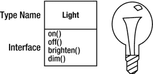
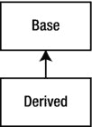
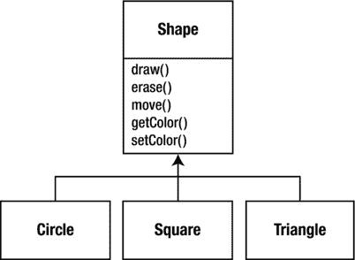
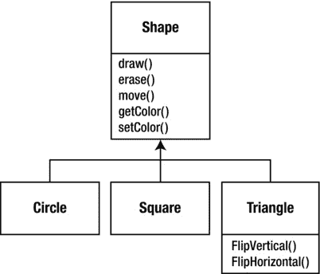
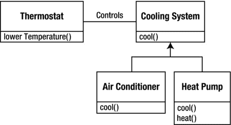
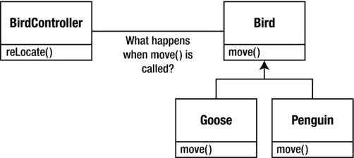
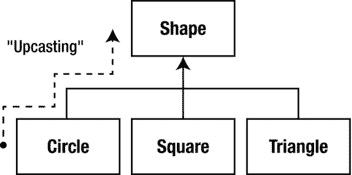
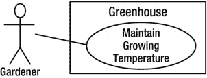

第一章


对象介绍

计算机革命起源于一台机器。因此，我们编程语言的起源看起来就像那台机器。

但是计算机与其说是机器，不如说是思维放大工具(“可以说是思维的自行车”)和一种不同的表达媒介。因此，这些工具看起来越来越不像机器，更像我们大脑的一部分，也像其他表达媒介，如写作、绘画、雕塑、动画和电影制作。面向对象编程是将计算机用作表达媒介的趋势的一部分。

本章将向你介绍面向对象编程的基本概念，包括 OOP 开发方法的概述。这一章和这本书都假设你有使用过程编程语言的经验，尽管不一定是 c。

这一章是背景和补充材料。许多人在没有首先了解全局的情况下，对涉足面向对象编程感到不舒服。因此，这里引入了许多概念来给你一个 OOP 的坚实的概述。然而，许多其他人直到他们首先看到了一些机制之后，才明白大图的概念；如果没有一些代码，这些人可能会陷入困境，迷失方向。如果你是后一种人，并且渴望了解这门语言的细节，可以跳过这一章；此时跳过它不会妨碍您编写程序或学习语言。然而，你最终会想回到这里来充实你的知识，这样你就能理解为什么对象是重要的，以及如何用它们来设计。

抽象的进展

所有编程语言都提供抽象。可以说，你能够解决的问题的复杂性与抽象的种类和质量直接相关。(“类”是指*你在抽象什么*。)汇编语言是底层机器的一个小抽象。随后出现的许多所谓的*命令式语言*都是汇编语言的抽象。这些语言比汇编语言有了很大的改进，但是它们的主要抽象仍然要求你根据计算机的结构而不是你试图解决的问题的结构来思考。程序员必须建立机器模型(在*解决方案空间*中，这是你对问题建模的地方，比如一台计算机)和实际正在解决的问题模型(在*问题空间*，这是问题存在的地方)之间的关联。执行这种映射所需要的努力，以及它对于编程语言来说是外在的这一事实，产生了难以编写且维护昂贵的程序，并且作为副作用，创造了整个编程方法行业。T11】

对机器建模的替代方法是对你试图解决的问题建模。PROLOG 将所有问题都转化为一连串的决策。已经为基于约束的编程和专门通过操纵图形符号的编程创建了语言。这些方法中的每一种都是解决特定问题的好方法，但是当你走出这个领域时，它们就变得笨拙了。

面向对象的方法更进一步，它为程序员提供了在问题空间中表示元素的工具。这种表示足够通用，程序员不会受限于任何特定类型的问题。我们将问题空间中的元素及其在解决方案空间中的表示称为*对象*。(当然，您还需要其他没有问题空间类似物的对象。)这个想法是允许程序通过添加新类型的对象来适应问题的术语，所以当你阅读描述解决方案的代码时，你也在阅读表达问题的单词。这是一个比我们以前拥有的更加灵活和强大的语言抽象。因此，OOP 允许你根据问题来描述问题，而不是根据解决方案运行的计算机。

不过，电脑还是有连接的。每个物体看起来都有点像一台小电脑；它有一个状态，你可以要求它执行一些操作。然而，这对于现实世界中的物体来说似乎不是一个坏的类比；都有特点和行为。

一些语言设计者认为面向对象编程本身不足以轻松解决所有编程问题，因此提倡将各种方法组合成多种编程语言。

有五个特征代表了面向对象编程的纯方法。

1.  一切都是物体。把一个物体想象成一个花式变量；它存储数据，但是您可以向该对象“发出请求”,要求它对自身执行操作。理论上，你可以在你试图解决的问题中采用任何概念成分(狗、建筑、服务等)。 *)* 并在你的程序中把它表现为一个对象。
2.  程序是一堆对象，它们通过发送消息告诉彼此该做什么。要向一个对象发出请求，你需要向该对象“发送一条消息”。更具体地说，您可以将消息视为调用属于特定对象的函数的请求。
3.  每个对象都有自己的记忆，由 ot **她的对象**组成。换句话说，通过制作包含现有对象的包来创建一种新的对象。因此，您可以在程序中构建复杂性，同时将它隐藏在对象的简单性后面。
4.  每个对象都有一个类型。按照这种说法，每个对象都是一个*类*的*实例*，其中“类”与“类型”同义一个类最重要的区别特征是你可以发送给它的消息。
5.  特定类型的所有对象可以接收相同的消息。因为类型为`circle`的对象也是类型为`shape`的对象，所以保证`circle`接受`shape`消息。这意味着你可以编写与`shapes`对话的代码，并自动处理任何符合形状描述的东西。这个*可替代性*是 OOP 中最强大的概念之一。

一个对象有一个接口

所有对象都是独一无二的，也是具有共同特征和行为的一类对象的一部分，这一思想被直接用于第一种面向对象语言 Simula-67，其基本关键字`class`为程序引入了一种新类型。

顾名思义，Simula 是为开发模拟而创建的，例如经典的银行出纳员问题。在这里，你有一堆出纳员、客户、账户、交易和货币单位——许多*对象*。在程序执行过程中，除了状态不同之外都相同的对象被分组到对象的*类*中，这就是关键字`class`的来源。创建抽象数据类型(类)是面向对象编程中的一个基本概念。抽象数据类型的工作方式几乎与内置类型完全一样:你可以创建一种类型的变量(在面向对象的说法中称为*对象*或*实例*)并操纵这些变量(称为*发送消息*或*请求*；你发送一条消息，对象就知道如何处理它)。每个类的成员(*元素*)都有一些共性:每个账户都有一个*余额*，每个柜员都可以接受存款，等等。同时，每个成员都有自己的状态，每个账户都有不同的余额，每个柜员都有名字。因此，柜员、客户、账户、交易等。都可以用计算机程序中的唯一实体来表示。这个实体就是对象，每个对象都属于一个定义其特征和行为的特定类。

因此，尽管我们在面向对象编程中真正做的是创建新的数据类型，但实际上所有面向对象编程语言都使用`class`关键字。当你看到“类型”这个词时，想想“类”，反之亦然。

由于类描述了一组具有相同特征(*数据元素*)和行为(*功能*)的对象，所以类实际上是一种数据类型，因为例如浮点数也具有一组特征和行为。区别在于程序员定义一个类来适应一个问题，而不是被迫使用一个现有的数据类型，该数据类型被设计来表示机器中的一个存储单元。您可以通过添加特定于您需求的新数据类型来扩展编程语言。编程系统欢迎新的类，并像对待内置类型一样给予它们所有的关心和类型检查。

面向对象的方法不限于构建模拟。不管你是否同意任何程序都是你正在设计的系统的模拟，OOP 技术的使用可以很容易地将大量的问题简化为一个简单的解决方案。

一旦建立了一个类，您就可以创建该类的任意多个对象，然后操纵这些对象，就好像它们是您试图解决的问题中存在的元素一样。事实上，面向对象编程的挑战之一是在问题空间的元素和解决方案空间的对象之间创建一对一的映射。

但是你如何让一个对象为你做有用的工作呢？必须有一种方法向对象发出请求，以便它做一些事情，比如完成一个事务，在屏幕上画一些东西，或者打开一个开关。每个对象只能满足特定的请求。你对一个对象的请求是由它的接口定义的，类型决定了接口。一个简单的例子可能是在[图 1-1](#Fig1) 中一个灯泡的表示，代码可能是

```cpp
Light lt;
lt.on();

```



[图 1-1](#_Fig1) 。灯泡的类型和接口

这个接口建立了*你可以对一个特定的对象发出什么样的*请求。但是，必须有代码来满足这个请求。这和隐藏的数据一起，组成了*实现*。从过程化编程的角度来看，这并不复杂。一个类型有一个与每个可能的请求相关联的函数，当你向一个对象发出一个特定的请求时，这个函数就会被调用。这个过程通常可以概括为:你向一个对象发送一条消息(*发出一个请求*，然后这个对象计算出如何处理这条消息(*它执行代码*)。

这里，类型/类的名字是`Light`，这个特定的`Light`对象的名字是`lt`，你可以对一个`Light`对象发出的请求是打开它、关闭它、使它变亮或变暗。通过为对象声明一个名字(`lt`)来创建一个`Light`对象。要向对象发送消息，您需要声明对象的名称，并用句点(点)将其连接到消息请求。从预定义类的用户的角度来看，这就是用对象编程的全部内容。

[图 1-1](#Fig1) 遵循统一建模语言(UML) 的格式。每个类都用一个盒子来表示，盒子的顶部是类型名，你想描述的任何数据成员在盒子的中间部分，而*成员函数*(属于这个对象的函数，它接收你发送给那个对象的任何消息)在盒子的底部。通常，UML 设计图中只显示类名和公共成员函数，因此中间部分没有显示。如果您只对类名感兴趣，那么底部也不需要显示。

隐藏的实现

将竞技场分成*类创建者*(创建新数据类型的人)和*客户端程序员*(在应用程序中使用数据类型的类消费者)是有帮助的。客户端程序员的目标是收集一个装满类的工具箱，用于快速应用程序开发。类创建者的目标是构建一个只向客户端程序员公开必要内容的类，而隐藏其他所有内容。为什么呢？因为如果它是隐藏的，客户端程序员就不能使用它，这意味着类创建者可以随意更改隐藏的部分，而不用担心对其他任何人的影响。隐藏部分通常表示对象的脆弱内部，很容易被粗心或不知情的客户端程序员破坏，因此隐藏实现可以减少程序错误。*实现隐藏的概念怎么强调都不为过*。

在任何关系中，重要的是要有各方都尊重的界限。当您创建一个库时，您与客户程序员建立了一种关系，客户程序员也是一名程序员，但他正在使用您的库组装一个应用程序，可能是为了构建一个更大的库。

如果每个人都可以使用一个类的所有成员，那么客户端程序员就可以对这个类做任何事情，并且没有办法强制执行规则。尽管您可能真的希望客户端程序员不要直接操作您的类的一些成员，但是没有访问控制就没有办法阻止它。一切对世界都是赤裸裸的。

因此，访问控制的第一个原因是让客户端程序员不要接触他们不应该接触的部分——数据类型的内部机制所必需的部分，但不是用户解决特定问题所需的界面的一部分。这实际上是对用户的一种服务，因为他们可以很容易地看到对他们来说什么是重要的，什么是可以忽略的。

访问控制的第二个原因是允许库设计者改变类的内部工作方式，而不用担心它会如何影响客户程序员。例如，您可能以简单的方式实现了一个特定的类以简化开发，然后发现您需要重写它以使它运行得更快。如果接口和实现被清晰的分离和保护，你可以很容易的完成，并且只需要用户重新链接。

C++使用三个显式关键字来设置类的边界:`public`、`private`和`protected`。它们的用法和含义非常简单。这些*访问说明符*决定了谁可以使用后面的定义。`public`表示每个人都可以使用以下定义。另一方面，`private`关键字意味着除了你——该类型的创建者——之外，没有人可以访问该类型的成员函数中的那些定义。`private`是你和客户程序员之间的一堵砖墙。如果有人试图访问一个`private`成员，他们会得到一个编译时错误。`protected`的行为就像`private`一样，除了继承类可以访问`protected`成员，但不能访问`private`成员。*继承*即将推出。

重用实现

一旦一个类被创建和测试，它应该(理想地)代表一个有用的代码单元。事实证明，这种可重用性并不像许多人希望的那样容易实现；产生一个好的设计需要经验和洞察力。但是一旦你有了这样的设计，它就乞求被重用。代码重用是面向对象编程语言提供的最大优势之一。

重用一个类最简单的方法是直接使用该类的一个对象，但是你也可以将该类的一个对象放在一个新的类中。我们称之为“创建成员对象”您的新类可以由任意数量和类型的其他对象组成，您可以根据需要以任意组合来实现新类所需的功能。因为您正在从现有的类中组合一个新的类，所以这个概念被称为*组合*(或者更一般地说，*聚合*)。构图，如图 1-2 中的[所示，通常被称为“has-a”关系，就像“一辆汽车有一个引擎”](#Fig2)


[图 1-2](#_Fig2) 。显示组合(“有-有”关系)

(这个 UML 图用实心菱形表示组成，表示*有一辆汽车*。我将典型地使用一种更简单的形式:只有一条线，*，没有菱形*，来表示一个关联。)

作曲有很大的灵活性。新类的成员对象通常是私有的，这使得使用该类的客户端程序员无法访问它们。这允许您在不干扰现有客户端代码的情况下更改这些成员。您还可以在运行时更改成员对象，以动态地更改程序的行为。接下来描述的继承没有这种灵活性，因为编译器必须对用继承创建的类进行编译时限制。

因为继承在面向对象编程中非常重要，所以它经常被高度强调，新的程序员可以理解继承应该在任何地方使用。这可能导致笨拙和过于复杂的设计。相反，在创建新类时，您应该首先考虑组合，因为它更简单、更灵活。如果你采用这种方法，你的设计会更整洁。一旦你有了一些经验，当你需要继承的时候就相当明显了。

继承:重用接口

就其本身而言，对象的概念是一个方便的工具。它允许你通过*概念*将数据和功能打包在一起，这样你就可以代表一个合适的问题空间想法，而不是被迫使用底层机器的习惯用法。这些概念通过使用关键字`class`被表达为编程语言中的基本单元。

然而，令人遗憾的是，费尽周折创建一个类，然后又被迫创建一个可能具有类似功能的全新的类。如果您可以获取现有的类，克隆它，然后对克隆进行添加和修改，那就更好了。这实际上是你通过继承得到的，除了如果原始类(称为*基*或*超*或*父*类)被改变，修改后的“克隆”(称为*派生的*或*继承的*或*子*或*子*类)也会反映这些改变。

(图 1-3 中[UML 图中的箭头从派生类指向基类。正如您将看到的，可以有多个派生类。)](#Fig3)



[图 1-3](#_Fig3) 。显示继承(从超类派生子类)

类型不仅仅描述一组对象的约束；和其他类型也有关系。两种类型可以有共同的特征和行为，但是一种类型可能比另一种类型包含更多的特征，并且还可能处理更多的消息(或者以不同的方式处理它们)。继承使用基类型和派生类型的概念来表达类型之间的这种相似性。基类型包含从它派生的类型之间共享的所有特征和行为。您创建一个基本类型来表示您对系统中一些对象的核心想法。从基本类型中，您可以派生出其他类型来表达实现这个核心的不同方式。

例如，垃圾回收机器将垃圾分类。基础类型是`trash`，每一片垃圾都有重量、价值等等，可以撕碎、融化、分解。由此衍生出更多特定类型的垃圾，它们可能具有额外的特征(瓶子有颜色)或行为(铝罐可能被压碎，钢罐有磁性)。此外，有些行为可能是不同的(纸张的价值取决于其类型和条件)。使用继承，您可以构建一个类型层次结构，用它的类型来表达您试图解决的问题。

第二个例子如图 1-4 中的[所示，是经典的`Shape`例子，可能用于计算机辅助设计系统或游戏模拟。基础类型是`Shape`，每个形状都有大小、颜色、位置等等。每个形状都可以被绘制、擦除、移动、着色等。由此衍生出特定类型的形状(*继承* ): `Circle`、`Square`、`Triangle`等等，每一种都可能有额外的特征和行为。例如，某些形状可以翻转。有些行为可能会有所不同，例如当您想要计算形状的面积时。类型层次结构体现了形状之间的相似性和差异。](#Fig4)



[图 1-4](#_Fig4) 。显示形状的类型层次结构

用与问题相同的术语来描述解决方案是非常有益的，因为从问题的描述到解决方案的描述不需要很多中间模型。对于对象，类型层次结构是主要模型，因此您可以直接从现实世界中的系统描述转到代码中的系统描述。事实上，人们对于面向对象设计的一个困难是，从开始到结束都太简单了。一个被训练去寻找复杂解决方案的头脑通常在一开始会被这种简单性难倒。

当从现有类型继承时，会创建一个新类型。这个新类型不仅包含现有类型的所有成员(尽管`private`的成员被隐藏起来，不可访问)，更重要的是它复制了基类的接口。也就是说，可以发送给基类对象的所有消息也可以发送给派生类对象。因为你可以通过发送给它的消息知道一个类的类型，这意味着*派生类和基类*是相同的类型。在前面的例子中，`Circle`是一个`Shape`。这种通过继承实现的类型等价是理解面向对象编程意义的基本途径之一。

因为基类和派生类都有相同的接口，所以必须有一些实现来配合该接口。也就是说，当一个对象接收到一个特定的消息时，必须有一些代码要执行。如果你只是简单地继承一个类，不做任何其他事情，基类接口的方法会直接进入派生类。这意味着派生类的对象不仅具有相同的类型，它们还具有相同的行为，这并不特别有趣。

有两种方法可以区分新的派生类和原始基类。第一种非常简单:只需向派生类中添加全新的函数。这些新函数不是基类接口的一部分。这意味着基类没有做你想要的那么多，所以你添加了更多的函数。这种简单原始的继承用法有时是解决问题的完美方案。但是，您应该仔细寻找您的基类可能也需要这些附加函数的可能性。这个发现和迭代你的设计的过程，如图 1-5 ，所示，在面向对象编程中经常发生。



[图 1-5](#_Fig5) 。展示 OOP 中的迭代

虽然继承有时可能意味着您要向接口添加新的功能，但这不一定是真的。区分新类的第二个也是更重要的方法是*改变*现有基类函数的行为。这被称为*超越*该功能，如图[图 1-6](#Fig6) 所示。


[图 1-6](#_Fig6) 。显示 OOP 中函数的覆盖

要覆盖一个函数，只需在派生类中为该函数创建一个新的定义。你在说，“我在这里使用相同的接口函数，但是我希望它为我的新类型做一些不同的事情。”

Is-a 与 is-like-a 关系

关于继承可能会有一些争论:继承应该只覆盖*基类函数(*)而不添加不在基类中的新成员函数*)吗？这意味着派生类型与基类是完全相同的类型，因为它有完全相同的接口。因此，您完全可以用派生类的对象替换基类的对象。这可以被认为是*纯替代*，它通常被称为*替代原则*。从某种意义上说，这是对待继承的理想方式。在这种情况下，我们经常将基类和派生类之间的关系称为 *is-a* 关系，因为我们可以说“一个圆*是一个*形状。”对继承的一个测试是确定你是否能陈述关于类的 is-a 关系，并让它有意义。*

有时，您必须向派生类型添加新的接口元素，从而扩展接口并创建新的类型。新类型仍然可以替换基本类型，但是这种替换并不完美，因为不能从基本类型访问新函数。这可以描述为一个*是——像——一个*的关系；新类型有旧类型的接口，但也包含其他功能，所以你不能说它完全一样。例如，考虑一台空调(如图 1-7 中的[所示)。假设你的房子安装了所有的制冷控制器；也就是说，它有一个允许您控制冷却的界面。想象一下，空调坏了，你换成热泵，既能制热又能制冷。热泵*就像一台*空调，但它能做更多。因为你的房子的控制系统被设计成仅仅控制冷却，它被限制为与新物体的冷却部分通信。新对象的接口被扩展了，现有的系统除了原来的接口什么都不知道。](#Fig7)



[图 1-7](#_Fig7) 。冷却系统与温度控制系统

当然，一旦你看到这个设计，很明显基类`Cooling System`不够通用，应该被重命名为`Temperature Control System`，这样它也可以包括加热——在这一点上，替代原则将起作用。然而，[图 1-7](#Fig7) 中的图表是设计和现实世界中可能发生的例子。

当你看到替代原则时，很容易觉得这种方法(*纯替代*)是做事的唯一方式，事实上，如果你的设计以这种方式工作，那么*很好。但是你会发现，有时候同样清楚的是，你必须向一个派生类的接口添加新的函数。通过检查，这两种情况都应该相当明显。*

具有多态性的可互换对象

在处理类型层次结构时，您通常不希望将对象视为其特定类型，而是将其视为其基类型。这允许您编写不依赖于特定类型的代码。在 shape 示例中，函数操纵通用形状，而不管它们是`Circle` s、`Square` s、`Triangle` s 等等。所有形状都可以被绘制、擦除和移动，所以这些函数只是向一个`shape`对象发送一条消息；他们不担心对象如何处理信息。

这种代码不受添加新类型的影响，添加新类型是扩展面向对象程序以处理新情况的最常见方式。例如，您可以派生出一个名为`Pentagon`的`Shape`的新子类型，而无需修改只处理一般形状的函数。这种通过派生新的子类型来轻松扩展程序的能力非常重要，因为它极大地改进了设计，同时降低了软件维护的成本。

然而，试图将派生类型的对象作为它们的通用基本类型来对待会有一个问题(`Circles`作为`Shapes`、`Bicycles`作为`Vehicles`、`Cormorants`作为`Birds`等等)。).如果一个函数要告诉一个通用的形状来画它自己，或者告诉一个通用的车辆来驾驶，或者告诉一只通用的鸟来移动，编译器在编译时不能精确地知道哪段代码将被执行。这才是重点！当消息被发送时，程序员不希望*知道将执行哪段代码；`draw`函数同样适用于`Circle`、`Square`或`Triangle`，对象将根据其具体类型执行适当的代码。如果您不必知道将执行哪段代码，那么当您添加新的子类型时，它执行的代码可以不同，而无需更改函数调用。*

因此，编译器无法准确知道执行了哪段代码，它做了什么？例如，在[图 1-8](#Fig8) 中，`BirdController`对象只与通用`Bird`对象一起工作，并不知道它们的确切类型。从`BirdController`的角度来看，这很方便，因为它不必编写特殊的代码来确定它正在使用的`Bird`的确切类型，或者`Bird`的行为。那么，当调用`move()`而忽略特定类型的`Bird`时，正确的行为将会发生(a `Goose`跑、飞或游，a `Penguin`跑或游)是如何发生的呢？



[图 1-8](#_Fig8) 。非 OOP 中的早期绑定与 OOP 中的晚期绑定

答案是面向对象编程中的主要转折:*编译器不能进行传统意义上的函数调用*。非面向对象编译器生成的函数调用导致了所谓的*早期绑定*，这个术语你可能以前没有听说过，因为你从来没有以其他方式思考过。它意味着编译器生成一个对特定函数名的调用，链接器将这个调用解析为要执行的代码的绝对地址。在 OOP 中，程序直到运行时才能确定代码的地址，所以当一个消息被发送到一个通用对象时，一些其他的方案是必要的。

为了解决这个问题，面向对象语言使用了*后期绑定*的概念。当你向一个对象发送消息时，被调用的代码直到运行时才被确定。编译器确实确保函数存在，并对参数和返回值执行类型检查(这种情况不成立的语言被称为*弱类型*)，但它不知道要执行的确切代码。

为了执行后期绑定，C++编译器会插入一段特殊的代码来代替绝对调用。这段代码使用存储在对象中的信息计算函数体的地址(这个过程在第 15 章中有更详细的介绍)。因此，每个对象可以根据该特殊代码位的内容表现不同。当你向一个对象发送一条消息时，这个对象实际上知道如何处理这条消息。

您使用关键字`virtual`声明您希望函数具有后期绑定属性的灵活性。你不需要理解`virtual`的机制来使用它，但是没有它你就不能用 C++进行面向对象的编程。在 C++中，你必须记住添加`virtual`关键字，因为默认情况下，成员函数是*而不是*动态绑定的。虚函数允许你表达同一个家族中类的行为差异。这些差异导致了多态行为。

考虑一下`Shape`的例子。这一系列的类(都基于相同的统一接口)在本章前面已经画出了图表。为了演示多态性，您希望编写一段代码，这段代码忽略类型的具体细节，只与基类对话。该代码从特定于类型的信息中*解耦了*，因此更容易编写和理解。而且，如果一个新的类型——比如一个`Hexagon`——通过继承被添加，你写的代码对于新类型的`Shape`就像对于现有类型一样有效。因此，程序是可扩展的。

如果你用 C++写一个函数(你将很快学会如何做):

```cpp
void doStuff(Shape& s) {
s.erase();
  // ...
s.draw();
}
```

这个函数对任何一个`Shape`说话，所以它独立于它正在绘制和擦除的对象的具体类型(`&`的意思是“获取传递给`doStuff()`的对象的地址”，但是现在理解它的细节并不重要)。如果在程序的其他部分使用`doStuff()`函数

```cpp
Circle c;
Triangle t;
Line l;
doStuff(c);
doStuff(t);
doStuff(l);
```

不管对象的确切类型是什么，对`doStuff( )`的调用都会自动正常工作。

这实际上是一个相当惊人的把戏。想想这条线

```cpp
doStuff(c);

```

这里发生的是一个`Circle`被传递给一个期待一个`Shape`的函数。既然一个`Circle`T8 是一个`Shape`，那么就可以由`doStuff()`来当作一个。也就是说，`doStuff()`能发给 a `Shape`的任何消息，a `Circle`都能接受。所以这是一件完全安全和符合逻辑的事情。

我们称这个处理派生类型的过程为基础类型*向上转换*。名称 *cast* 用于铸造模具的意思，而 *up* 来自继承图的典型排列方式，基类在顶部，派生类向下展开。因此，强制转换为基类型是在继承图中向上移动；上抛如图 1-9 中的[所示。](#Fig9)



[图 1-9](#_Fig9) 。向上移动继承图，也称为“向上转换”

一个面向对象的程序在某个地方包含了一些向上转换，因为这是你不知道你正在使用的确切类型的方法。请看`doStuff()`中的代码:

```cpp
s.erase();
  // ...
s.draw();
```

注意，它没有说“如果你是一个`Circle`，做这个，如果你是一个`Square`，做那个，等等。”如果你写那种代码，检查一个`Shape`实际上可能是所有可能的类型，它是混乱的，你需要在每次添加一个新的`Shape`时修改它。在这里，你只要说“你是一个形状。我知道你自己可以`erase()`和`draw()`，所以去做吧，并且正确处理好细节。”

令人印象深刻的是，不知何故，正确的事情发生了。为`Circle`调用`draw()`会导致与为`Square`或`Line`调用`draw()`时不同的代码被执行，但是当`draw()`消息被发送到匿名`Shape`时，正确的行为会基于`Shape`的实际类型发生。这是惊人的，因为正如前面提到的，当 C++编译器为`doStuff()`编译代码时，它不能确切地知道它正在处理什么类型。所以通常，你会期望它最终为`Shape`调用`erase()`和`draw()`的版本，而不是为特定的`Circle`、`Square`或`Line`调用。然而，由于多态性，正确的事情发生了。编译器和运行时系统处理细节；你需要知道的只是它会发生，更重要的是如何利用它进行设计。如果一个成员函数是`virtual`，那么当你给一个对象发送一个消息时，这个对象会做正确的事情，即使涉及到向上转换。

创建和销毁对象

从技术上讲，OOP 的领域是抽象数据类型、继承和多态，但是其他问题至少同样重要。本节概述了这些问题。

尤其重要的是对象的创建和销毁方式。对象的数据在哪里，如何控制该对象的生命周期？不同的编程语言使用不同的哲学。C++认为控制效率是最重要的问题，所以它给程序员一个选择。为了获得最大的运行速度，可以在编写程序时通过将对象放在堆栈上或静态存储中来确定存储和生存期。堆栈是内存中的一个区域，微处理器在程序执行期间直接使用它来存储数据。栈上的变量有时被称为*自动*或*作用域*变量。静态存储区只是在程序开始运行之前分配的一块固定的内存。使用堆栈或静态存储区域优先考虑存储分配和释放的速度，这在某些情况下是有价值的。然而，您牺牲了灵活性，因为在编写程序时，您必须知道对象的确切数量、生存期和类型。如果你试图解决一个更一般的问题，比如计算机辅助设计、仓库管理或空中交通管制，这就太有限制性了。

第二种方法是在称为*堆*的内存池中动态创建对象。在这种方法中，直到运行时你才知道你需要多少对象，它们的寿命是多少，或者它们的确切类型是什么。那些决定是在程序运行时的瞬间做出的。如果需要一个新对象，只需在需要时使用`new`关键字在堆中创建它。当您完成存储时，您必须使用`delete`关键字释放它。

因为存储是在运行时动态管理的，所以在堆上分配存储所需的时间要比在堆栈上创建存储所需的时间长得多。(在堆栈上创建存储通常是一条向下移动堆栈指针的微处理器指令，另一条向上移动堆栈指针的微处理器指令)。动态方法作出了通常合乎逻辑的假设，即对象往往是复杂的，因此寻找存储和释放存储的额外开销不会对对象的创建产生重要影响。此外，更大的灵活性对于解决一般的编程问题是必不可少的。

然而，还有另一个问题，那就是对象的生命周期。如果在堆栈上或静态存储中创建一个对象，编译器会确定该对象持续的时间，并可以自动销毁它。但是，如果在堆上创建它，编译器就不知道它的生存期。在 C++中，程序员必须以编程方式确定何时销毁对象，然后使用`delete`关键字执行销毁。作为替代，环境可以提供一个叫做*垃圾收集器*的特性，当一个对象不再被使用时，它会自动发现并销毁它。当然，使用垃圾收集器编写程序要方便得多，但是它要求所有的应用程序必须能够容忍垃圾收集器的存在和垃圾收集的开销。这不符合 C++语言的设计要求，所以没有包括在内，尽管 C++有第三方垃圾收集器。

异常处理:处理错误

自从编程语言诞生以来，错误处理一直是最困难的问题之一。因为设计一个好的错误处理方案非常困难，所以许多语言干脆忽略了这个问题，把这个问题留给了库设计者，他们想出了在许多情况下都可以工作但很容易被绕过的中间措施，通常只需忽略它们。大多数错误处理方案的一个主要问题是，它们依赖程序员在遵循约定的约定时保持警惕，而该语言并不强制这样做。如果程序员不警惕(这在他们匆忙时经常发生)，这些方案很容易被忘记。

*异常处理*将错误处理直接连接到编程语言中，有时甚至连接到操作系统中。异常是从错误位置“抛出”的对象，并且可以被适当的*异常处理程序*捕获，该异常处理程序用于处理特定类型的错误。就好像异常处理是一条不同的并行执行路径，当出现问题时可以采用。因为它使用一个单独的执行路径，所以不需要干扰你正常执行的代码。这使得代码更容易编写，因为您不必经常检查错误。此外，抛出的异常不同于函数返回的错误值，也不同于函数为指示错误条件而设置的标志——这些都可以忽略。异常不能被忽略，所以它肯定会在某个时候被处理。最后，异常提供了一种从糟糕的情况中可靠恢复的方法。除了退出程序之外，你通常还能把事情做好，恢复程序的执行，这就产生了更加健壮的系统。

值得注意的是，异常处理不是面向对象的特性，尽管在面向对象语言中，异常通常用一个对象来表示。异常处理在面向对象语言之前就存在了。(你可能会注意到[第 17 章](17.html)详细介绍了异常处理)。

分析和设计

面向对象的范例是一种新的、不同的编程思维方式，许多人一开始不知道如何处理 OOP 项目。一旦你知道一切都应该是一个对象，并且当你学会更多地以面向对象的方式思考时，你就可以开始创建“好的”设计，利用 OOP 提供的所有好处。

一个*方法*(通常被称为*方法论*)是一组用于分解编程问题复杂性的过程和启发。自从面向对象编程出现以来，许多 OOP 方法已经被公式化了。这一节将让你对使用一种方法时你试图完成的事情有一个感觉。

尤其是在 OOP 中，方法学是一个需要很多实验的领域，所以在你考虑采用一个方法之前，理解这个方法试图解决什么问题是很重要的。对于 C++来说尤其如此，在 c++中，编程语言旨在降低表达程序所涉及的复杂性(与 *C* 相比)。事实上，这可能会减少对越来越复杂的方法的需求。相反，在 C++中，相对于使用简单的方法和过程化语言所能处理的问题，更简单的方法可能就足够了。

同样重要的是要意识到“方法论”这个术语经常太过宏大，承诺太多。无论你现在做什么，当你设计和编写一个程序的时候，都是一个方法。它可能是你自己的方法，你可能没有意识到这样做，但它是你在创作时经历的一个过程。如果这是一个有效的过程，它可能只需要一个小的调整就可以和 C++一起工作。如果你对你的生产力和你的程序结果不满意，你可能想考虑采用一个正式的方法，或者从许多正式的方法中选择一些。

当你经历发展过程时，最重要的问题是:*不要迷失*。这很容易做到。大多数分析和设计方法都是为了解决最大的问题。请记住，大多数项目都不属于这一类别，所以您通常可以使用方法推荐的相对较小的子集来进行成功的分析和设计。但是某种过程，不管多么有限，通常会比简单地开始编码更好地引导你前进。

也很容易卡住，陷入*分析瘫痪*，感觉自己无法前进，因为没有把现阶段的每一个小细节都钉死。请记住，无论您做了多少分析，都有一些关于系统的事情直到设计时才会显露出来，更多的事情直到您编写代码时才会显露出来，甚至直到程序启动并运行时才会显露出来。因此，非常快速地完成分析和设计，并对所提议的系统进行测试是至关重要的。

这一点值得强调。由于我们在过程化语言方面的历史，值得称赞的是，一个团队希望在转向设计和实现之前仔细地进行并理解每一分钟的细节。当然，在创建 DBMS 时，彻底了解客户的需求是有好处的。但是数据库管理系统是一类非常适定和容易理解的问题；在许多这样的程序中，数据库结构*是*要解决的问题。本章讨论的编程问题是一种不确定性问题，其中的解决方案不是简单地重新形成一个众所周知的解决方案，而是涉及一个或多个不确定因素——对于这些因素，以前没有很好的解决方案，因此有必要进行研究。*在进入设计和实现阶段之前试图彻底分析一个不确定的问题会导致分析的瘫痪，因为在分析阶段你没有足够的信息来解决这类问题。*解决这样的问题需要整个周期的迭代，这需要冒险行为(*这是有意义的，因为你正在尝试做一些新的事情，潜在的回报更高*)。看起来“匆忙”进入初步实现增加了风险，但这反而可以降低不确定项目中的风险，因为您可以尽早发现解决问题的特定方法是否可行。*产品开发就是风险管理*。

人们经常建议你“造一个扔掉”使用 OOP，你可能仍然会扔掉它的*部分*，但是因为代码被封装到类中，在第一次迭代中，你将不可避免地产生一些有用的类设计，并开发一些关于系统设计的有价值的想法，这些想法不需要被扔掉。因此，对一个问题的第一次快速处理不仅为下一次分析、设计和实现迭代产生了关键信息，还为该迭代创建了代码基础。

也就是说，如果你正在寻找一个包含大量细节和建议许多步骤和文档的方法，仍然很难知道什么时候停止。记住你想要发现什么。

1.  有哪些对象？(你如何将你的项目划分成它的组成部分？)
2.  它们的接口是什么？(您需要能够向每个对象发送什么消息？)

如果你除了对象和它们的接口什么都没有，那么你可以写一个程序。出于各种原因，你可能需要比这更多的描述和文档，但你不能少了。

这个过程可以分为五个阶段，第 0 阶段只是使用某种结构的最初承诺。

阶段 0:制定计划

你必须首先决定在你的过程中有哪些步骤。这听起来很简单(事实上，所有这些听起来都很简单),然而人们通常不会在开始编码之前做出这个决定。如果你的计划是“让我们跳进来开始编码”，很好。至少同意这是计划。

 **注意**有时当你有一个很好理解的问题时，这是合适的。

您也可以在这个阶段决定一些额外的过程结构是必要的，但不是全部。可以理解的是，一些程序员喜欢在*休假模式*下工作，在这种模式下，开发他们的工作`;`的过程没有强加任何结构，换句话说*，*“该完成的时候就完成了。”这可能在一段时间内很有吸引力，但是*沿途有几个里程碑有助于围绕这些里程碑集中和激励你的努力，而不是停留在单一的目标**完成项目*。此外，它将项目分成更小的部分，使它看起来不那么具有威胁性(加上里程碑提供了更多庆祝的机会)。

使命宣言

你建立的任何系统，不管有多复杂，都有一个基本的目的——它所在的行业，它满足的基本需求。如果你能越过用户界面、硬件或系统特定的细节、编码算法和效率问题，你最终会发现它的本质，简单而直接。就像好莱坞电影里所谓的*高概念*一样，可以用一两句话来形容。这种纯粹的描述是起点。

高概念相当重要，因为它为你的项目定下了基调；这是一份使命宣言。你不一定第一次就做对了(你可能会在项目的后期才变得完全清晰)，但要不断尝试，直到感觉正确为止。例如，在一个空中交通管制系统中，你可能从一个高度的概念开始，这个概念集中在你正在构建的系统上:“塔台程序跟踪飞机。”但是考虑一下当你把系统缩小到一个非常小的机场时会发生什么；也许只有一个人类控制器，或者根本没有。一个更有用的模型不会关注你正在创建的解决方案，而是描述问题:“飞机到达，卸载，维修和重装，然后离开。”

阶段 1 :我们在做什么？

在上一代程序设计(称为*过程化设计*)中，这被称为“创建*需求分析*和*系统规格说明*”这些当然是容易迷路的地方；名字令人生畏的文件本身就可能成为大项目。然而，本意是好的。

需求分析包括列出一系列指导方针，用于了解工作何时完成以及客户何时满意。系统规范是对程序将做什么(而不是如何做)来满足需求的描述。需求分析实际上是你和客户之间的一个契约(即使客户在你的公司工作，或者是一些其他的对象或系统)。系统规范是对问题的顶级探索，在某种意义上是对是否可以完成以及需要多长时间的发现。因为这两者都需要人们达成共识(而且因为它们通常会随着时间的推移而改变)，所以通常最好是让它们尽可能的简洁——最好是列表和基本图表——以节省时间。您可能有其他约束条件，要求您将它们扩展成更大的文档，但是通过保持初始文档小而简洁，它可以在领导者的几次小组头脑风暴中创建，领导者可以动态地创建描述。这不仅会征求每个人的意见，还会培养团队中每个人最初的认同和同意。也许最重要的是，它能以极大的热情启动一个项目。

在这个阶段，有必要把注意力集中在你要完成的核心任务上:确定系统应该做什么。最有价值的工具是所谓的*用例*的集合。用例识别系统中的关键特性，这些特性将揭示你将要使用的一些基本类。这些基本上是对一些问题的描述性回答，比如:

*   “谁会用这个系统？”
*   "那些演员能用这个系统做什么？"
*   "这个演员是如何用这个系统做到的？"
*   “如果其他人这么做，或者如果同一个演员有不同的目标，这怎么可能行得通？”(揭示变化)
*   "用系统做这些可能会发生什么问题？"(揭示例外情况)

例如，如果你正在设计一个自动柜员机，系统功能的一个特定方面的用例能够描述自动柜员机在每一种可能的情况下做什么。这些情况中的每一种都被称为*场景*，一个用例可以被认为是场景的集合。你可以把一个场景想象成一个问题，这个问题以“如果...?"例如，如果客户在 24 小时内刚存入一张支票，但没有支票，账户中没有足够的钱来提供所需的取款，自动柜员机会怎么做？T3】

图 1-10 中的用例图是为了防止你过早地陷入系统实现的细节中。


[图 1-10](#_Fig10) 。自动柜员机(ATM)用例图

每个 stick person 代表一个 *actor* ，它通常是一个人或某种其他类型的自由代理。(这些甚至可以是其他计算机系统，就像自动取款机一样。)方框代表你系统的边界。省略号代表用例，这些用例描述了系统可以执行的有价值的工作。参与者和用例之间的线代表了交互。

系统实际上是如何实现的并不重要，只要对用户来说是这样的。

一个用例不需要非常复杂，即使底层系统很复杂。它仅用于向用户展示系统。例如，[图 1-11](#Fig11) 显示了一个简单的用例图。



[图 1-11](#_Fig11) 。展示了底层复杂系统的简单用例图

用例通过确定用户可能与系统的所有交互来产生需求规格。你试图为你的系统发现一套完整的用例，一旦你完成了，你就有了系统应该做什么的核心。关注用例的好处在于，它们总是把你带回到本质上，并且防止你偏离到对完成工作不重要的问题上。也就是说，如果你有一套完整的用例，你就可以描述你的系统并进入下一个阶段。第一次尝试时，你可能无法完全理解，但没关系。一切都会及时显露出来，如果此时你要求一个完美的系统规范，你会被卡住。

如果你被卡住了，你可以使用一个粗略的近似工具来启动这个阶段:用几个段落描述这个系统，然后寻找名词和动词。名词可以暗示参与者、用例的上下文(例如，“大厅”)，或者用例中操作的工件。动词可以暗示参与者和用例之间的交互，并指定用例中的步骤。您还会发现名词和动词在设计阶段产生对象和消息(注意用例描述子系统之间的交互，因此名词和动词技术只能用作头脑风暴工具，因为它不产生用例)。

用例与参与者之间的边界可以指出用户界面的存在，但它并没有定义这样的用户界面。现在你已经对你正在构建的东西有了一个大概的了解，所以你可能会知道这需要多长时间。这里有很多因素在起作用。如果你估计一个很长的时间表，公司可能会决定不建立它(从而将他们的资源用在更合理的事情上——这是一件好事情)。或者经理可能已经决定了项目需要多长时间，并试图影响你的估计。但是最好从一开始就有一个诚实的时间表，并尽早处理艰难的决定。已经有很多尝试想出准确的调度技术(像预测股票市场的技术)，但可能最好的方法是依靠你的经验和直觉。凭直觉判断到底需要多长时间，然后加倍，再加 10%。*你的直觉可能是正确的；你可以在这段时间内找到工作*。“加倍”将把它变成体面的东西，10%将处理最后的抛光和细节。无论你想如何解释它，不管当你透露这样一个时间表时会发生什么样的抱怨和操纵，它似乎就是那样工作的。

第二阶段:我们将如何建造它？

在这一阶段，你必须想出一个设计来描述这些类看起来像什么，以及它们将如何交互。确定类别和交互的一个优秀技术是*类别责任协作* (CRC) 卡片。这个工具的部分价值在于它的技术含量很低:你从一套 3×5 的空白卡片开始，然后在上面写字。每张卡片代表一个班级，在卡片上写下以下内容:

1.  **类的名称**。重要的是这个名字抓住了类的本质，这样一看就明白了。
2.  **班级的“职责”——应该做什么**。这通常可以通过陈述成员函数的名称来总结(因为在一个好的设计中，这些名称应该是描述性的)，但这并不排除其他注释。如果你需要播种这个过程，从一个懒惰的程序员的角度来看这个问题。你希望有什么东西神奇地出现来解决你的问题？
3.  **类的“协作”:它还与其他什么类交互？**“互动”是一个有意宽泛的术语；它可能意味着聚合，或者仅仅是某个其他对象的存在，它将为该类的某个对象执行服务。合作也应该考虑这门课的观众。例如，如果你创建了一个类`Firecracker`，谁来观察它，一个`Chemist`还是一个`Spectator`？前者会想知道什么化学物质进入建筑，后者会对爆炸时释放的颜色和形状做出反应。

你可能会觉得卡片应该更大，因为你想在上面得到所有的信息，但它们是故意小的，不仅是为了保持你的班级小，也是为了防止你过早进入太多的细节。如果你不能在一张小卡片上写下你需要知道的关于一个类的所有内容，那么这个类就太复杂了(要么你写得太详细，要么你应该创建多个类)。理想的班级应该是一眼就能看懂的。CRC 卡的想法是帮助你完成设计的第一步，这样你就可以了解整体情况，然后优化你的设计。

CRC 卡的一大好处就是通信。最好是在没有电脑的情况下，在一个小组中实时完成。每个人负责几个班级(最初没有名字或其他信息)。您通过一次解决一个场景来运行实时模拟，决定将哪些消息发送到不同的对象以满足每个场景。当你经历这个过程时，你会发现你需要的类以及它们的职责和协作，当你这样做时，你会填写卡片。当你完成了所有的用例，你应该对你的设计有一个相当完整的第一次切割。

在我开始使用 CRC 卡之前，我在提出初始设计时最成功的咨询经历是站在一个以前没有构建过 OOP 项目的团队面前，在白板上绘制对象。我们讨论了对象之间应该如何通信，并删除了其中的一些对象，用其他对象替换它们。实际上，CRC 卡是在白板上管理的。团队(知道项目应该做什么)实际上创建了设计；他们“拥有”设计，而不是别人给他们设计。所有需要做的就是通过问正确的问题来指导这个过程，尝试这些假设，并从团队获得反馈来修改这些假设。这个过程的真正美妙之处在于，团队学会了如何进行面向对象的设计，而不是通过回顾抽象的例子，而是通过致力于他们当时最感兴趣的一个设计:他们自己的设计。

一旦你有了一套 CRC 卡，你可能想用 UML 为你的设计创建一个更正式的描述。你不需要使用 UML，但是它会很有帮助，特别是如果你想在墙上贴一个图表让大家思考，这是一个好主意。UML 的另一种选择是对象及其接口的文本描述，或者是代码本身，这取决于您的编程语言。

UML 还为描述系统的动态模型提供了额外的图表符号。这在系统或子系统的状态转换占主导地位，需要它们自己的图的情况下(例如在控制系统中)很有帮助。您可能还需要描述数据占主导地位的系统或子系统(如数据库)的数据结构。

当你描述完对象及其接口后，你就知道第二阶段已经完成了。好吧，大部分都是——通常会有一些漏网之鱼，直到第三阶段才被发现。不过没关系。你所关心的是你最终会发现你所有的物品。在过程的早期发现它们是很好的，但是 OOP 提供了足够的结构，所以如果你后来发现它们也不是那么糟糕。事实上，在整个程序开发过程中，一个对象的设计往往发生在五个阶段。

对象设计的五个阶段

一个对象的设计寿命并不局限于你写程序的时候。相反，一个对象的设计出现在一系列的阶段。拥有这种观点是有帮助的，因为你会立刻停止期待完美；相反，你意识到对一个物体做什么和它应该是什么样子的理解是随着时间而发生的。这个观点也适用于各种类型程序的设计；一个特定类型的程序的模式是通过一次又一次地与那个问题进行斗争而出现的。对象也有它们的模式，这些模式是通过理解、使用和重用形成的。

1.  **物体发现。** *这个阶段发生在程序的初始分析期间。*通过寻找外部因素和边界、系统中元素的重复以及最小的概念单元，可以发现对象。如果你已经有了一套类库，有些对象是显而易见的。暗示基类和继承的类之间的共同性可能马上出现，或者在设计过程的后期出现。
2.  **对象组装。** *当你在构建一个对象时，你会发现需要一些在发现过程中没有出现的新成员*。对象的内部需求可能需要其他类来支持它。
3.  **系统建设。** *再一次，对一个对象的更多需求可能出现在这个后期*。当你学习时，你进化你的对象。与系统中的其他对象进行通信和互连的需求可能会改变您的类的需求，或者需要新的类。例如，您可能会发现需要包含很少或没有状态信息的辅助类，如链表，它们只是帮助其他类运行。
4.  **系统扩展。** *当您向系统添加新功能时，您可能会发现您以前的设计不支持简单的系统扩展*。有了这些新信息，您就可以重新构建系统的各个部分，可能会添加新的类或类层次结构。
5.  **对象重用。** *这是一个班级真正的压力测试*。如果有人试图在一个全新的环境中重用它，他们可能会发现一些缺点。随着你改变一个类来适应更多的新程序，这个类的一般原理会变得更加清晰，直到你有了一个真正可重用的*类型*。然而，不要期望系统设计中的大多数对象是可重用的；您的大部分对象是系统特定的，这是完全可以接受的。可重用类型往往不太常见，为了可重用，它们必须解决更一般的问题。

对象开发指南

当考虑开发你的类时，这些阶段提供了一些指导方针。

1.  **让一个具体的问题生成一个类**，然后让这个类在其他问题的解决过程中成长成熟。
2.  **记住，发现你需要的类(和它们的接口)**是系统设计的主要部分。如果你已经有了这些类，这将是一个简单的项目。
3.  **不要一开始就强迫自己什么都知道**；边走边学。这无论如何都会发生。
4.  **开始编程；让一些东西工作起来，这样你就可以证明或否定你的设计**。不要担心你最终会得到过程式的意大利面条式代码——类将问题分开，有助于控制混乱和熵。坏课不会破坏好课。
5.  永远保持简单。具有明显效用的小而干净的对象比大而复杂的接口要好。当决策点出现时，考虑选择并选择最简单的一个，因为简单的类几乎总是最好的。从小而简单开始，当你更好地理解它时，你可以扩展类接口，但是随着时间的推移，很难从类中移除元素。

阶段 3:构建核心

这是从粗略设计到可测试的编译和执行代码体的最初转换，尤其是证明或否定你的架构。这不是一个一次性的过程，而是迭代构建系统的一系列步骤的开始，正如您将在阶段 4 中看到的。

*你的目标是找到需要实现的系统架构的核心，以便生成一个可运行的系统，*不管这个系统在最初阶段是多么不完整。您正在创建一个框架，您可以在此基础上进行进一步的迭代。您还执行许多系统集成和测试中的第一个，并向涉众反馈他们的系统将会是什么样子以及进展如何。理想情况下，你也暴露了一些关键的风险。您可能还会发现可以对您的原始体系结构进行的更改和改进——如果不实现该系统，您将不会学到这些东西。

构建系统的一部分是你从需求分析和系统规范(无论以什么形式存在)的测试中得到的现实检查。确保您的测试验证了需求和用例。当系统的核心稳定后，您就可以继续前进并添加更多的功能了。

阶段 4:迭代用例

一旦核心框架开始运行，您添加的每个特性集本身就是一个小项目。您在*迭代*期间添加一个特性集，这是一个相当短的开发周期。

**一次迭代**有多大？理想情况下，每次迭代持续一到三周(*这可以根据实现语言*而变化)。在这一阶段结束时，您将拥有一个集成的、经过测试的系统，比以前拥有更多的功能。但是特别有趣的是迭代的基础:单一用例。每一个用例都是一个相关功能的包，你可以在一次迭代中一次性构建到系统中，*。*这不仅让你对用例的范围有了更好的了解，也让你对用例的概念有了更多的确认，因为这个概念在分析和设计之后并没有被抛弃，相反，它是整个软件构建过程中的一个基本开发单元。

当您实现目标功能或者外部截止日期到来，并且客户对当前版本满意时，您停止迭代。(*记住，软件是订阅业务*。)因为流程是迭代的，所以你有很多机会去出货一个产品，而不是一个单一的端点；开源项目只在迭代、高反馈的环境中工作，这正是它们成功的原因。

由于许多原因，迭代开发过程是有价值的。您可以在早期发现并解决关键风险，客户有充分的机会改变他们的想法，程序员的满意度更高，项目可以更精确地进行。但是一个额外的重要好处是对涉众的反馈，他们可以通过产品的当前状态准确地看到所有东西在哪里。这可能会减少或消除对令人麻木的状态会议的需求，并增加风险承担者的信心和支持。

第五阶段:进化

这是开发周期中传统上被称为*维护*的点，这是一个包罗万象的术语，可以指从“让它按照最初真正应该的方式工作”到“添加客户忘记提到的功能”再到更传统的“修复出现的错误”和“根据需要添加新功能”的一切如此多的误解被应用到术语“维护”上，以至于它有了一点欺骗的性质，部分是因为它表明你实际上已经建立了一个原始的程序，你需要做的只是更换部件，给它上油，并防止它生锈。也许有一个更好的术语来描述正在发生的事情。

**让我们用术语** ***进化*** 。换句话说，*你不会第一次就做对，所以给自己学习和回头做出改变的自由。随着你学习和更深入地理解这个问题，你可能需要做很多改变。无论是从短期还是长期来看，如果你进化到正确的程度，你所产生的优雅将会得到回报。*演进是你的程序从优秀走向卓越的地方*，在那里你在第一遍中没有真正理解的问题变得清晰。这也是您的类可以从单一项目用途发展为可重用资源的地方。*

“做对”的含义不仅仅是程序根据需求和用例工作。这还意味着代码的内部结构对您来说是有意义的，并且感觉它很好地组合在一起，没有笨拙的语法、过大的对象或笨拙的代码暴露位。此外，您必须有某种感觉，程序结构将在它的生命周期中不可避免地经历变化，并且这些变化可以容易和干净地进行。这不是一个小壮举。你不仅要明白你在构建什么，还要明白程序将如何发展。幸运的是，面向对象的编程语言特别擅长支持这种持续的修改——由对象创建的边界有助于防止结构崩溃。它们还允许您进行更改——那些在过程化程序中看起来很激烈的更改——而不会在整个代码中引起地震。事实上，对进化的支持可能是 OOP 最重要的好处。

*随着进化，你创造出至少接近你认为你正在建造的东西，*然后你踢踢轮胎，把它和你的需求比较，看看它在哪里有不足。然后你可以回头通过重新设计和重新实现程序中不能正常工作的部分来修复它。在你找到正确的解决方案之前，你可能真的需要解决这个问题，或者问题的一个方面，好几次。

当你建立了一个系统，看到它符合你的需求，然后发现它实际上不是你想要的，进化也会发生。当你看到系统运行时，你会发现你真的想解决一个不同的问题。如果你认为这种进化将会发生，那么你应该尽可能快地构建你的第一个版本，这样你就可以发现它是否确实是你想要的。

也许要记住的最重要的事情是，默认情况下——根据定义，真的——*如果你修改了一个类，那么它的超类和子类将仍然起作用*。您不必害怕修改(*，尤其是如果您有一组内置的单元测试来验证您的修改的正确性*)。修改不一定会破坏程序，任何结果的改变都将局限于你所改变的类的子类和/或特定的合作者。

计划有回报

没有大量精心绘制的平面图，你是不会建造房子的。如果你建造一个甲板或狗屋，你的计划不会如此详细，但你可能仍然会从某种草图开始，以指导你前进。

软件开发已经走向了极端。很长一段时间，人们在开发中没有太多的结构，但后来大型项目开始失败。作为回应，我们最终得到了具有令人生畏的大量结构和细节的方法，主要用于那些大型项目。这些方法学使用起来太可怕了——看起来你会把所有的时间都花在编写文档上，而没有时间编程。

但是，通过遵循一个计划(最好是一个简单而简短的计划)并在编码之前提出设计结构，你会发现事情比你一头扎进去开始黑客攻击要容易得多，而且你也会意识到很大的满足感。根据我的经验，想出一个优雅的解决方案在完全不同的层面上是非常令人满意的；感觉更接近艺术而不是科技。而优雅总是有回报的；不是轻浮的追求。它不仅让您的程序更容易构建和调试，而且也更容易理解和维护，这就是财务价值所在。

极限编程

在所有的分析和设计技术中，*极限编程* ( *XP* )的概念是最激进的，也是最令人愉快的。XP 既是一种关于编程工作的哲学，也是一套做编程工作的指导方针。这些指导方针中的一些反映在最近的其他方法中，但是两个最重要和不同的贡献是*先写测试*和*成对编程*。

首先编写测试

传统上，测试被放在项目的最后一部分，在你“做好一切工作，但只是为了确保万无一失”之后它的优先级很低，专门从事这方面工作的人没有得到很多地位，甚至经常被隔离在地下室里，远离“真正的程序员”测试团队也以同样的方式回应，甚至穿着黑色的衣服，每当他们打破了什么东西就高兴地咯咯笑。

XP 通过赋予测试与代码同等(甚至更高)的优先权，彻底革新了测试的概念。事实上，你在编写被测试的代码之前编写测试*，测试将永远伴随着代码。每次您进行项目集成时，测试都必须成功执行(这通常是——有时一天不止一次)。*

首先编写测试有两个极其重要的作用。 *首先，它强制定义了一个类的接口*。XP 测试策略比这更进一步——它确切地指定了*对于该类的消费者来说该类必须是什么样子，以及该类必须如何行为。你可以写所有的散文或者创建所有你想要的图表来描述一个类应该如何表现以及它看起来像什么，但是没有什么比一组测试更真实的了。前者是一个愿望清单，但是测试是一个由编译器和运行程序强制执行的契约。很难想象有比测试更具体的描述了。*

在创建测试时，你被迫完全思考出类，并且经常会发现在 UML 图、CRC 卡、用例*、*等的思考实验中可能遗漏的所需功能。

编写测试的第二个重要影响来自于每次构建软件时运行测试。该活动为您提供了由编译器执行的另一半测试。如果你从这个角度来看编程语言的发展，你会发现技术的真正进步实际上是围绕着测试的。汇编语言只检查语法，但是 C 语言施加了一些语义限制，这些限制防止你犯某些类型的错误。OOP 语言强加了更多的语义限制，如果你仔细想想，这实际上是测试的形式。“这种数据类型使用正确吗？该函数是否被正确调用？”是由编译器或运行时系统执行的测试种类。

我们已经看到了将这些测试嵌入语言的结果:人们已经能够用更少的时间和精力编写更复杂的系统，并让它们工作。但是语言设计所提供的内置测试只能到此为止。在某些时候，*你*必须介入并添加剩余的测试，产生一个完整的套件(与编译器和运行时系统合作)来验证你的整个程序。而且，就像有一个编译器在你身后监视一样，难道你不想让这些测试从一开始就帮助你吗？这就是为什么您首先编写它们，并在每次构建系统时自动运行它们。你的测试成为语言提供的安全网的延伸。

使用越来越强大的编程语言会鼓励并允许你尝试更大胆的实验，因为这种语言会让你避免浪费时间去追踪 bug。XP 测试方案对你的整个项目做同样的事情。因为您知道您的测试将总是捕捉您引入的任何问题(并且当您想到它们时，您会定期添加任何新的测试)，所以您可以在需要时进行大的更改，而不用担心您会将整个项目完全打乱。这是难以置信的强大。

结对编程

结对编程违背了我们从一开始就被灌输的个人主义。程序员也被认为是个性的典范。然而，XP 本身也在与传统思维作斗争，它说每个工作站应该有两个人来编写代码。这应该在有一组工作站的区域进行，没有设施设计人员喜欢的障碍。

结对编程的价值在于，一个人实际上在做编码，而另一个人在思考。思考者将大局记在心里，不仅仅是手头问题的图景，而是 XP 的指导方针。例如，如果两个人一起工作，其中一个不太可能说“我不想先写测试”。如果编码员卡住了，他们可以交换位置。如果他们两个都被卡住了，他们的想法可能会被工作区里能提供帮助的其他人听到。两人一组工作让事情顺利进行。或许更重要的是，它让编程变得更加社会化和有趣。

C++为什么成功

C++如此成功的部分原因是，它的目标不仅仅是将 C 变成面向对象的语言(尽管它是以这种方式开始的)，还解决了开发人员今天面临的许多其他问题，尤其是那些在 C 语言上有大量投资的人。传统上，OOP 语言受到这样一种态度的影响，即你应该放弃你所知道的一切，从零开始，使用一套新的概念和新的语法，认为从长远来看，最好丢掉过程化语言带来的所有旧包袱。从长远来看，这可能是真的。但从短期来看，许多包袱是有价值的。最有价值的元素可能不是现有的代码库(如果有足够的工具，可以翻译)，而是现有的*思维库*。如果你是一个正常工作的 C 程序员，为了采用一种新的语言，你必须放弃你所知道的关于 C 的一切，你会立刻在几个月内变得效率低下，直到你的头脑适应新的范例。然而，如果您能够利用现有的 C 语言知识并对其进行扩展，那么在进入面向对象编程的世界时，您可以继续使用您已经知道的知识进行生产。由于每个人都有他或她自己的编程心理模型，这一步已经够乱的了，因为没有从头开始一个新的语言模型的额外费用。所以 C++成功的原因，简而言之，是经济上的:转移到面向对象程序设计仍然需要成本，但 C++的成本可能会更低。

C++的目标是提高生产力。这种生产力来自许多方面，但这种语言旨在尽可能多地帮助您，同时尽可能少地妨碍您使用任意规则或任何要求您使用特定功能集的要求。C++的设计是为了实用；C++语言设计决策的基础是为程序员提供最大的好处(至少从 C 的角度来看)。

更好的 C

即使您继续编写 C 代码，您也能立即获得成功，因为 C++已经弥补了 C 语言中的许多漏洞，并提供了更好的类型检查和编译时分析。你被迫声明函数，这样编译器可以检查它们的使用。对于值替换和宏来说，对预处理器的需求实际上已经消除了，这消除了一系列难以发现的错误。C++有一个叫做*引用*的特性，它允许更方便地处理函数参数和返回值的地址。名字的处理通过一个叫做*函数重载*的特性得到了改进，它允许你对不同的函数使用相同的名字。名为 *namespaces* 的特性也改进了对名字的控制。还有许多更小的功能可以提高 c 的安全性

你已经在学习曲线上了

学习一门新语言的问题在于效率。没有一家公司能够承受因为学习一门新语言而突然失去一名高效的软件工程师。C++是对 C 的扩展，而不是全新的语法和编程模型。它允许您继续创建有用的代码，随着您学习和理解它们，逐渐应用这些特性。这可能是 C++成功的最重要的原因之一。

此外，所有现有的 C 代码在 C++中仍然是可行的，但是因为 C++编译器更挑剔，所以在用 C++重新编译代码时，您经常会发现隐藏的 C 错误。

效率

有时候，用执行速度换取程序员的生产力是合适的。例如，一个财务模型可能只在短时间内有用，因此快速创建模型比快速执行模型更重要。然而，大多数应用程序都需要一定程度的效率，所以 C++总是偏向于更高的效率。因为 C 程序员倾向于非常注重效率，这也是一种确保他们不会认为语言太胖太慢的方法。C++中的许多特性旨在允许您在生成的代码不够高效时进行性能调优。

您不仅拥有与 C 中相同的低级控制能力(以及在 C++程序中直接编写汇编语言的能力)，而且轶事证据表明，面向对象的 C++程序的编程速度往往与用 C 编写的程序相差不到 10%，甚至更接近。面向对象程序的设计实际上可能比 C 语言程序更有效。

系统更容易表达和理解

为适应问题而设计的课程往往能更好地表达问题。这意味着当你写代码时，你是在用问题空间的术语描述你的解决方案，而不是用计算机的术语，计算机是解决方案空间。您处理更高级的概念，并且可以用一行代码做更多的事情。

易于表达的另一个好处是维护，这在程序的生命周期中占据了很大一部分成本。如果一个程序更容易理解，那么它就更容易维护。这也可以降低创建和维护文档的成本。

最大限度地利用图书馆

创建程序最快的方法是使用已经写好的代码:一个库。*c++的一个主要目标是使库的使用更容易。*这是通过将库转换成新的数据类型(类)来实现的，因此引入库意味着向语言中添加新的类型。因为 C++编译器负责处理库的使用方式——保证正确的初始化和清理，并确保正确调用函数——所以您可以专注于希望库做什么，而不是必须如何做。

因为名字可以通过 C++命名空间隔离到程序的各个部分，所以您可以使用任意多的库，而不会遇到 C *中的名字冲突。*

模板的源代码重用

有一类重要的类型需要修改源代码才能有效地重用它们。C++中的模板特性自动执行源代码修改，使其成为重用库代码的特别强大的工具。使用模板设计的类型将毫不费力地与许多其他类型一起工作。模板特别好，因为它们对客户程序员隐藏了这种代码重用的复杂性。

错误处理

*C 中的错误处理是一个臭名昭著的问题，也是一个经常被忽视的问题；手指交叉通常涉及*。如果你正在构建一个大型复杂的程序，没有什么比把一个错误埋在某个地方而不知道它来自哪里更糟糕的了。 *C++异常处理*(本章介绍，后面的[第 17 章](17.html)已经提到过了)*是一种保证错误被注意到并且结果发生的方式*。

大型编程

许多传统语言对程序的大小和复杂性有内在的限制。例如，BASIC 可以很好地为某些类型的问题提供快速的解决方案，但是如果程序超过几页或者超出了该语言的正常问题范围，就像试图在越来越粘稠的液体中游泳一样。c 也有这些限制。例如，当一个程序超过 50，000 行代码时，名字冲突就开始成为一个问题——实际上，你用完了函数和变量名。另一个特别糟糕的问题是 C 语言中的小漏洞——隐藏在大型程序中的错误很难被发现。

没有明确的界限告诉你什么时候你的语言让你失望了，即使有，你也会忽略它。你不会说，“我的 BASIC 程序变得太大了；我只好用 C 语言重写了！”相反，你试图硬塞几行代码来增加一个新特性。因此，额外的成本会悄悄逼近你。

C++的设计是为了*帮助*进行大范围的编程——也就是说，消除小程序和大程序之间的复杂界限。当您编写 Hello，World 类型的实用程序时，您当然不需要使用 OOP、模板、名称空间和异常处理，但是当您需要它们时，这些特性就在那里。编译器积极地为大大小小的程序找出产生错误的错误。

过渡战略

如果你购买 OOP，你的下一个问题可能是，“我如何让我的经理/同事/部门/同事开始使用对象？”想想你——一个独立的程序员——将如何着手学习使用一门新的语言和一种新的编程范式。你以前做过。首先是教育和榜样；接下来是一个试验项目，让你在不做任何令人困惑的事情的情况下对基础有所了解。然后，一个真正有用的项目出现了。在你的第一个项目中，你通过阅读、向专家提问和与朋友交换提示来继续你的教育。这是许多有经验的程序员建议的从 C 转换到 C++的方法。更换整个公司当然会引入一定的团队动力，但在每一步都要记住一个人会怎么做。

指导方针

这里有一些向 OOP 和 C++过渡时要考虑的指导方针。

培养

第一步是某种形式的教育。记住公司在纯 C 代码上的投资，在六到九个月的时间里，当每个人都在困惑多重继承是如何工作的时候，尽量不要把一切都搞乱。选择一个小团体进行灌输，最好是由好奇的人组成的团体，他们可以很好地合作，并且在学习 C++时可以作为他们自己的支持网络。

有时建议的另一种方法是同时对所有公司级别进行教育，包括战略经理的概述课程以及项目建设者的设计和编程课程。这对于那些正在从根本上改变做事方式的小公司，或者大公司的部门来说尤其有利。然而，因为成本更高，一些人可能选择从项目级培训开始，做一个试点项目(可能有外部导师)，让项目团队成为公司其他人的老师。

低风险项目

首先尝试一个低风险的项目，并允许出现错误。一旦你获得了一些经验，你就可以从第一个团队的成员那里播种其他项目，或者使用团队成员作为 OOP 技术支持人员。第一个项目可能第一次就不能正常工作，所以它对公司来说不应该是关键任务。它应该是简单的、独立的、有指导意义的；这意味着它应该包括创建对公司其他程序员学习 C++有意义的类。

成功的典范

从头开始之前，找出好的面向对象设计的例子。很有可能有人已经解决了你的问题，如果他们还没有完全解决，你可以应用你所学到的抽象来修改现有的设计以满足你的需求。

使用现有类库

转向 OOP 的主要经济动机是类库形式的现有代码的简单使用，特别是标准的 C++库。当您除了`main( )`之外什么都不需要写，从现成的库中创建和使用对象时，最短的应用程序开发周期就会产生。然而，一些新程序员不理解这一点，不知道现有的类库，或者通过对语言的迷恋，渴望编写可能已经存在的类。如果您在转换过程的早期努力寻找并重用其他人的代码，那么您在 OOP 和 C++方面的成功将会得到优化。

不要用 C++重写现有代码

虽然用 C++编译器编译你的 *C* 代码通常会通过发现旧代码中的问题而产生(*有时是巨大的*)好处，但是利用现有的功能代码并用 C++重写它通常不是最好的方式。(如果一定要把它变成对象，可以把 C 代码“包装”在 C++类里。)好处越来越多，尤其是当代码被重用时。但是，除非是一个新项目，否则在最初的几个项目中，你可能看不到你所希望的生产率的显著提高。当把一个项目从概念变成现实时，C++和 OOP 表现得最好。

管理障碍

如果你是一名经理，你的工作是为你的团队获取资源，克服团队成功的障碍，并努力提供最有成效和最愉快的环境，这样你的团队最有可能实现那些总是要求你的奇迹。迁移到 C++属于这三种类型，如果它不需要你付出任何代价，那就太好了。尽管对于一个 C 程序员团队来说，迁移到 C++可能比面向对象编程更便宜(取决于您的约束条件)，但*它不是免费的，*在试图在您的公司内部推销迁移到 C++并着手进行迁移之前，您应该知道一些障碍。T3】

启动成本

迁移到 C++的成本不仅仅是购买 C++编译器(最好的编译器之一 GNU C++编译器是免费的)。如果你投资于培训(也可能是指导你的第一个项目),如果你发现并购买能解决你的问题的类库，而不是试图自己构建这些类库，你的中长期成本将会最小化。这些是硬货币成本，必须纳入现实的提案中。此外，在学习一门新语言和可能的新编程环境时，生产力的损失也是隐性成本。培训和指导当然可以减少这些，但是团队成员必须克服自己的困难去理解新技术。在这个过程中，他们会犯更多的错误(*这是一个特点，因为承认错误是学习的最快途径*)并且效率更低。即使这样，有了一些类型的编程问题、正确的类和正确的开发环境，你学习 C++的时候也有可能比继续学习 c++更有效率(即使考虑到你犯的错误更多，每天写的代码更少)

性能问题

一个常见的问题是，“面向对象程序设计不会自动让我的程序变得更大更慢吗？”答案是，“看情况。”大多数传统的 OOP 语言在设计时都考虑了实验和快速原型，而不是精益和平均操作。因此，它们实际上保证了尺寸的显著增加和速度的降低。然而，C++是为生产编程而设计的。当您关注快速原型时，您可以在忽略效率问题的同时尽可能快地组装组件。如果你使用任何第三方库，这些库通常已经被他们的供应商优化过了；在任何情况下，当您处于快速开发模式时，这都不是问题。当你有一个你喜欢的系统，如果它够小够快，那么你就完成了。如果没有，您可以开始用一个分析工具进行调优，首先寻找可以用内置 C++特性的简单应用程序实现的加速。如果这没有帮助，您可以在底层实现中寻找可以进行的修改，这样就不需要更改使用特定类的代码。只有在没有其他办法解决问题的情况下，你才需要改变设计。性能在这部分设计中如此重要，这表明它必须是主要设计标准的一部分。*您可以通过快速开发尽早发现这一点。*

几乎普遍地，从 C(或其他一些过程化语言)迁移到 C++(或其他一些面向对象的语言)的程序员都有编程效率大大提高的亲身经历，这是你能找到的最有说服力的论据。

常见设计错误

当你的团队开始使用 OOP 和 C++时，程序员通常会经历一系列常见的设计错误。之所以经常出现这种情况，是因为在早期项目的设计和实施过程中，专家的反馈太少，因为公司内部没有培养出专家，可能会有挽留顾问的阻力。人们很容易觉得自己在周期中过早地理解了 OOP，并偏离了正确的方向。对于语言老手来说显而易见的事情对于新手来说可能是一个内部争论的话题。通过使用经验丰富的外部专家进行培训和指导，可以避免这种创伤。

另一方面，容易犯这些设计错误的事实指向了 C++的主要缺点:*它与 C* 的向后兼容性(当然这也是它的主要优势)。为了完成能够编译 C 代码的壮举，该语言必须做出一些妥协，这导致了许多“黑暗角落”这些都是事实，并且构成了语言学习曲线的一部分。

审查会议

1.  本章试图让你对面向对象编程和 C++的广泛问题有一个感觉，包括为什么 OOP 是不同的，特别是为什么 C++是不同的，OOP 方法的概念，以及最后当你把你自己的公司转移到 OOP 和 C++时你会遇到的各种问题。
2.  *OOP 和 C++可能并不适合所有人*。评估您自己的需求并决定 C++是否能最好地满足这些需求，或者如果您使用另一个编程系统(包括您目前正在使用的系统)可能会更好，这一点很重要。如果你知道你的需求在可预见的将来会非常专门化，并且如果你有 C++可能无法满足的特定约束，那么你就应该自己去研究替代方案。*即使你最终选择 C++作为你的语言，你至少会明白有哪些选择，并且清楚地知道你为什么选择这个方向*。
3.  你知道过程化程序是什么样子:数据定义和函数调用。为了找到这样一个程序的意义，你必须做一些工作，浏览函数调用和底层概念，在你的头脑中创建一个模型。这就是我们在设计过程程序时需要中间表示的原因——就其本身而言，这些程序往往令人困惑，因为表达的术语更倾向于计算机，而不是你正在解决的问题。
4.  因为 C++向 C 语言中添加了许多新概念，所以您自然会认为 C++程序中的`main( )`会比同等的 C 程序复杂得多。在这里，你会惊喜地发现:一个编写良好的 C++程序通常比同等的 C 程序简单得多，也容易理解得多。您将看到的是代表您的问题空间中的概念的对象的定义(而不是计算机表示的问题),以及发送到这些对象以代表该空间中的活动的消息。*面向对象编程的乐趣之一是，对于一个设计良好的程序来说，通过阅读它很容易理解代码*。通常代码也要少得多，因为许多问题都可以通过重用现有的库代码来解决。